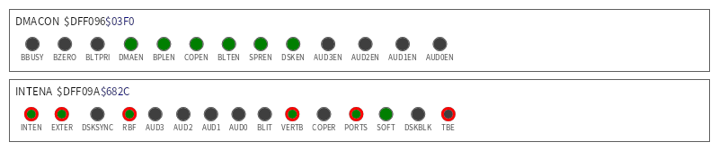
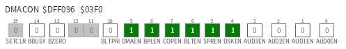
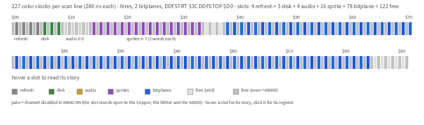
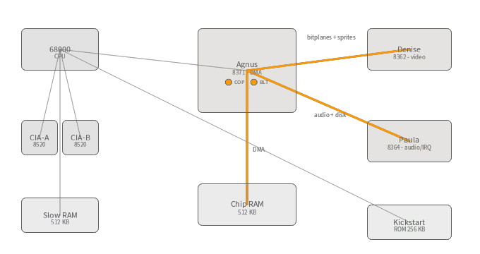
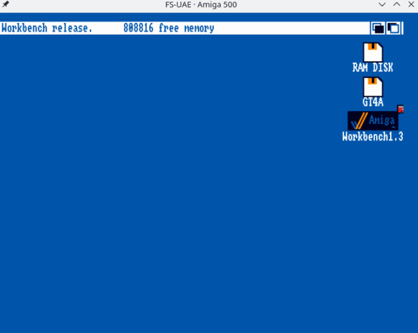
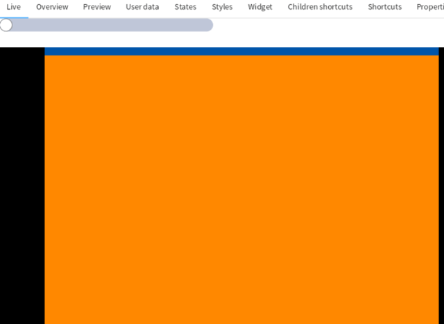
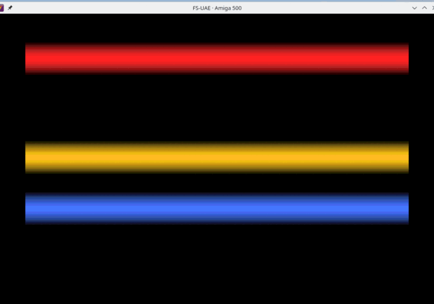

<div align="right"><a href="README.md">🇬🇧 English</a> · <a href="README.es.md">🇪🇸 Español</a></div>

# Amiga ChipLab

**Un modelo vivo y moldeable del hardware personalizado del Amiga — y una plataforma para construir cuadernos interactivos que lo enseñan.**

Amiga ChipLab convierte un Amiga en marcha (real o emulado) en objetos que inspeccionas y manejas en tiempo real desde [GToolkit](https://gtoolkit.com) *(GToolkit es un entorno de programación Smalltalk "vivo"; sus cuadernos Lepiter son como Jupyter, pero cada fragmento es un objeto vivo que puedes inspeccionar y remodelar)*. Cada registro del chipset es un objeto vivo que lees y escribes con seguridad, las figuras del Hardware Reference Manual están **dibujadas desde la máquina real** en vez de impresas, y ensamblas y ejecutas 68000 con el ciclo de feedback más corto que existe — todo dentro de una página Lepiter.

> El código, los paquetes y las clases se llaman **GT4Amiga** (GT = GToolkit). *Amiga ChipLab* es la plataforma que forman.

## Qué te da

- **El chipset como objetos vivos** — los registros personalizados modelados con su semántica de acceso real (`#read`/`#write`/`#setClear`/`#strobe`), decodificados bit a bit. Léelos, y conmuta con un clic los que son seguros — una política de seguridad de escritura marca qué bits cortarían el enlace del monitor o dejarían una tarea colgada, así que jugar nunca inutiliza la máquina.
  <p>
    <br>
    
  </p>
- **Figuras vivas del Hardware Reference Manual** — el diagrama de time-slots de DMA por línea de barrido (fig. 6-9 del AHRM) y el diagrama de bloques de la máquina, coloreados desde el BPLCON0/DMACON/DDF *reales* leídos de la propia copper list de Workbench — no imágenes estáticas.
  <p>
    <br>
    
  </p>
- **Maneja el Amiga desde una UI, en tiempo real** — un slider de GToolkit moviendo una línea de split de color del Copper, o el color de fondo de Workbench, en la pantalla real — de ida y vuelta por el monitor mientras arrastras.
  <p></p>
  <p></p>
- **Ensambla y ejecuta, al instante** — desde un Hola Mundo anotado hasta copper bars nativas a 50 fps en el blanking vertical, escritas en una página y ejecutadas como su propio proceso de AmigaDOS mientras el monitor sigue sirviendo comandos en vivo.
  <p></p>
- **Un monitor residente** — lee/escribe memoria y registros del chip, llama a cualquier función de librería de AmigaOS, y ejecuta programas, sobre un pequeño protocolo binario enmarcado (serie bajo FS-UAE, TCP en hardware real).

Las páginas Lepiter actuales se distribuyen como **cuadernos de ejemplo** que muestran lo que la plataforma puede hacer; los **libros** de enseñanza completos (un AHRM vivo, programación de videojuegos, 68000) se construyen sobre estos modelos y viven en [sus propios repositorios](#libros-construidos-sobre-amiga-chiplab).

## Cómo funciona

```
┌─ host — GToolkit (Pharo / Lepiter) ─────────────────────────────┐
│                                                                 │
│  Páginas de cuaderno Lepiter                                    │
│    ├─ modelo de hardware vivo — registros, máquina, chips como  │
│    │    objetos con gtViews que reflejan Y actúan sobre el chip │
│    └─ amiga68kSnippet — Ensambla → vasmm68k_mot → binario hunk  │
│                                                                 │
│  GT4AmigaMonitorClient — cliente de protocolo (R/W/B/P/C/S/X/Q) │
│  GT4FSUAERunner — ciclo de vida FS-UAE, socket TCP, pipeline run:│
└─────────┬──────────────────────────────────┬────────────────────┘
          │ protocolo binario enmarcado       │ intercambio de ficheros
          │ TCP :2345 (FS-UAE puentea SER:,   │ shared/ ⇄ GT4A:
          │ el hardware real habla TCP/IP)    │ programa entra, salida sale
┌─────────┴──────────────────────────────────┴────────────────────┐
│ Amiga — FS-UAE (Kickstart 1.3) o A500 real (PiStorm/Emu68)      │
│                                                                 │
│  gt4amiga-monitor — el único programa residente                 │
│  (lanzado al arrancar por S:User-Startup)                       │
│    ├─ R / W / B / P  lee y escribe memoria y registros del chip │
│    ├─ C      llama a cualquier función de librería de AmigaOS   │
│    ├─ S      puntero a la pantalla de Workbench                 │
│    ├─ Q      salir                                              │
│    └─ X      ejecuta GT4A:incoming/program como su propio proceso│
│                └─ Output() → GT4A:outgoing/output → Lepiter     │
│              …el monitor sigue sirviendo comandos entretanto    │
└─────────────────────────────────────────────────────────────────┘
```

El lado Amiga ejecuta un único programa residente: **gt4amiga-monitor**, lanzado al arrancar por `S:User-Startup`. Responde a un pequeño protocolo binario enmarcado — peek/poke de memoria, llamadas genéricas a librerías de AmigaOS, y ejecución de programas — por el puerto serie (que FS-UAE puentea a un socket TCP) o por una pila TCP/IP real en hardware real. El lado Pharo lee y escribe el estado del chip a través de él para mantener sincronizados los modelos vivos; para ejecutar un snippet, deja el ejecutable ensamblado en el directorio compartido y envía un comando de ejecución, y el programa corre como su propio proceso de AmigaDOS con su salida capturada de vuelta al cuaderno — todo mientras el monitor sigue sirviendo comandos en vivo. Consulta [PROTOCOL.es.md](docs/PROTOCOL.es.md) para el formato del protocolo.

## Primeros pasos

Instala los [prerequisitos](docs/SETUP.es.md#prerequisitos) (GToolkit, `vasmm68k_mot`, FS-UAE, una ROM de Kickstart y un HDF de Workbench), luego sigue [SETUP.es.md](docs/SETUP.es.md) para la colocación de ROM/disco, la nota sobre la config de FS-UAE, y el autoarranque del monitor en el lado Amiga (una sola vez).

Carga la plataforma — abre un Playground de Pharo dentro de GToolkit y evalúa:

```smalltalk
Metacello new
    repository: 'github://luque/gt4amiga/src';
    baseline: 'GT4Amiga';
    load.
```

Luego adjunta la base de conocimiento Lepiter con los cuadernos de ejemplo:

```smalltalk
BaselineOfGT4Amiga loadLepiter.
```

Ensambla y ejecuta 68000 sin siquiera abrir una página:

```smalltalk
| result |
result := GT4AmigaAssembler new assemble: '
        SECTION code,CODE
start:
        move.l  4.w,a6
        moveq   #0,d0
        rts
'.
GT4FSUAERunner default run: result.
```

## Cuadernos de ejemplo

Distribuidos como páginas Lepiter, demuestran los bloques de construcción de la plataforma. (Escritos en español.)

| Página | Qué muestra |
|--------|-------------|
| **El Ensamblador — Primeros Pasos** | Cómo funciona el ensamblador: tres ejemplos progresivos, de un programa mínimo solo con `rts` a aritmética y acceso a sección de datos |
| **Hola Amiga — Primer Programa 68000** | La convención de llamada a librerías de AmigaOS, `dos.library`, y un Hola Mundo completamente anotado en ensamblador 68000 |
| **Tomar y Liberar el Hardware — Forbid, Disable y DMA** | Tomar el control exclusivo del hardware del Amiga y liberarlo limpiamente para que el SO sobreviva |
| **El Bridge Server — Controlar el Amiga en Vivo** | Peek/poke en vivo y llamadas genéricas a librerías: leer `ExecBase`, cambiar el fondo de Workbench con `SetRGB4`, y un slider de GToolkit manejando el color en tiempo real |
| **El Copper — Un Split de Color en Vivo** | Construir una copper list mínima palabra a palabra en chip RAM viva, instalarla con seguridad, y mover la línea de split de color en tiempo real desde un slider |
| **Lectura en Bloque — La Pantalla de Workbench dentro del Libro** | Los opcodes de transferencia por bloque en acción: navegar `Screen`→`BitMap`, leer la paleta con `GetRGB4`, y componer la pantalla viva de Workbench como imagen dentro del cuaderno |
| **El Chipset del Amiga — Registros como Objetos Vivos** | El catálogo de registros del chip como modelo vivo: semántica de acceso, campos decodificados, y la cadena de conocibilidad de cada registro |
| **El Panel de Control — DMACON e INTENA con Interruptores** | El panel de control de la máquina en Bloc: cada bit escribible un interruptor clicable, con los bits críticos para el enlace bloqueados |
| **La Máquina — Un Diagrama de Bloques Vivo** | Todo el A500 como un modelo: diagrama de bloques clicable con las flechas de DMA encendidas desde el DMACON vivo, mapa de memoria con volcados hex, medidores de memoria vivos |
| **Los Time Slots de DMA — La Línea de Barrido en Vivo** | La figura central del AHRM viva: 227 color clocks por línea de barrido, quién posee cada slot, y la ventana de fetch de bitplanes dibujada desde el BPLCON0/DDFSTRT/DDFSTOP reales |
| **Copper Bars — Rasterbars de la Demoscene** | El efecto insignia de la demoscene del Amiga construido en Pharo, escrito por bloque a chip RAM, animado por el puente, y el Workbench restaurado por software vía `GfxBase->LOFlist` |
| **Copper Bars Nativas — 50 FPS en el Blanking Vertical** | El mismo efecto a la manera de la demoscene: un programa nativo 68k animando las barras a 50 fps en el blanking vertical |

## Libros construidos sobre Amiga ChipLab

Los libros de enseñanza completos componen los modelos y figuras vivas de ChipLab para la mejor didáctica posible. Evolucionan a su propio ritmo, en sus propios repositorios:

- **El Hardware Reference del Amiga, vivo** — la materia del AHRM, capítulo a capítulo, como figuras vivas y ejemplos interactivos. *(próximamente)*
- **Programación de videojuegos Amiga** — un juego construido paso a paso a lo largo de los capítulos. *(planificado)*
- **Ensamblador 68000** — un curso general sobre la CPU con el ciclo ensamblar-y-ejecutar e inspección en vivo. *(planificado)*

## Estructura del proyecto

```
gt4amiga/
├── src/
│   ├── BaselineOfGT4Amiga/       Baseline de Metacello
│   ├── GT4Amiga-Core/            Wrapper del ensamblador, resultado, configuración
│   ├── GT4Amiga-FSUAE/           Gestor de procesos FS-UAE
│   ├── GT4Amiga-Bridge/          Cliente del monitor + protocolo binario enmarcado
│   ├── GT4Amiga-Hardware/        Modelo de hardware vivo (registros, máquina, chips)
│   ├── GT4Amiga-Hardware-UI/     Vistas Bloc (panel de control, diagramas, figuras vivas)
│   ├── GT4Amiga-Lepiter/         Tipo de snippet Lepiter y elemento
│   └── GT4Amiga-MCP/             Servidor Lepiter/eval para tooling
├── lepiter/                      Base de conocimiento Lepiter (cuadernos de ejemplo)
├── docs/                         Instalación, protocolo, roadmap
├── rom/                          Ficheros de ROM de Kickstart (ignorados por git)
├── hdf/                          Imágenes HDF de Workbench (ignoradas por git)
├── shared/                       Directorio de intercambio host↔Amiga
│   ├── incoming/                 Binario del monitor + programas enviados al Amiga
│   └── outgoing/                 Salida de programas capturada en el Amiga
└── amiga/s/                      gt4amiga-monitor.s (el monitor residente) y scripts de arranque de AmigaDOS
```

## Documentación

- **[Instalación](docs/SETUP.es.md)** — prerequisitos, ROM/disco, config FS-UAE, vasm, autoarranque del monitor
- **[Protocolo](docs/PROTOCOL.es.md)** — el protocolo binario enmarcado, para escribir otro cliente
- **[Roadmap](docs/ROADMAP.es.md)** — qué está hecho y qué viene, en la plataforma

## Licencia

MIT — ver [LICENSE](LICENSE).
